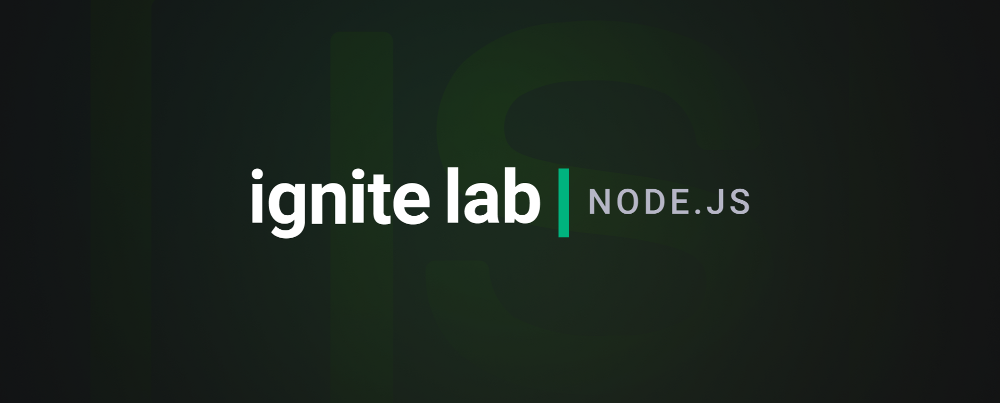

<p align="center">
  
</p>

<p align="center">

   <a href="https://www.linkedin.com/in/felipefrmelo/">
      
   </a>

</p>

## 💬 Projeto

Este projeto foi desenvolvido durante o evento Ignite Lab 2, da Rocketseat. O mesmo teve como objetivo desenvolver um microsserviço de notificações, utilizando a abordagem de design orientado a domínio (DDD) e focando em aplicar importantes conceitos do SOLID, como a inversão de dependência e o princípio da responsabilide única.

## 🧪 Tecnologias

Esse projeto foi desenvolvido com as seguintes tecnologias:

  * [Typescript](https://www.typescriptlang.org/)
  * [Node.js](https://nodejs.org/)
  * [NestJS](https://nestjs.com/)
  * [Jest](https://jestjs.io/pt-BR/)
  * [Prisma](https://www.prisma.io/)

## 🚀 Como executar

* Clone o projeto e acesse a pasta do mesmo.

```bash
$ git clone https://github.com/felipefrm/notifications-microservice
$ cd notifications-microservice
```

* Instale as dependências:
```bash
$ npm install
```

* Inicie a aplicação:
```bash
$ npm start
```

* O projeto estará disponível no seu browser pelo endereço http://localhost:3000.

---


# 👨‍💻 Autores

<table>
  <tr>
    <td align="center">
      <a href="https://www.linkedin.com/in/felipefrmelo/">
        
        <br />
        <sub>
          <b>Felipe Melo</b>
        </sub>
       </a>
       <br />
       <a href="http://github.com/felipefrm/" title="Linkedin">@felipefrm</a>
    </td>
    <td align="center">
      <a href="https://rocketseat.com.br/">
        
        <br />
        <sub>
          <b>Rocketseat</b>
        </sub>
       </a>
       <br />
       <a href="https://github.com/Rocketseat" title="Linkedin">@Rocketseat</a>
    </td>
  </tr>
</table>